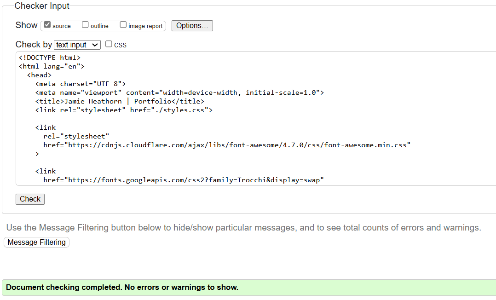

# Overview

Welcome to my front end software developer portfolio! This README file provides information about the content, creation, and learning process involved with creating this site.

## Introduction

The portfolio webpage provides information about myself and the projects I've created, as well as giving visitors a way to contact me. This will be actively updated throughout my career.

## User Stories

### First Time Visitor Goals:

- As a first-time vistor, I want to easily understand the main purpose of the site and what it does.
- As a first-time visitor, I want to easily navigate the webpage.
- As a first-time visitor, I want to feel interested in reading about the author and their projects.

### Returning Visitor Goals

- As a returning visitor, I want to easily check if the author has created more projects.

- As a returning visitor, I want to easily recognise how to find the sections that I'm interested in.

### Frequent Visitor Goals

- As a frequent visitor, I want quick access to the author's latest projects.

### Target Audience Is:

- Interested in front end software development.
- Interested in potential candidates for front end development roles.
- Interested in evaluating skills and experience.
- Interested in collaborating on projects or sharing knowledge.

## Features

### The website exists on one page with multiple sections and features visible to the user:

- At the top of the page, fixed to the viewport, is a navigation bar with a small graphic logo and links to the different sections of the webpage.

  

- The first section of the webpage visible to the user is the Home section. This features an image of me and my current title.

  

- The second section of the webpage visible to the user is the About section. This features articles that provide information about myself.

  

  - When hovered over, the heading of the article becomes underlined and a small dropbox appears around the background to highlight the box the user's mouse is hovering over.

    

- The third section is the Projects section. This displays various projects that I have worked on. Currently, it houses 2 projects, and a project template.

  

  - When the container holding the image and caption is hovered over, the image blurs and a text box appears, allowing the user to view the project via a hyperlink.

  - Currently, the template takes the user to Projects section until a viewable project becomes available.

    

- The fourth section is the Contact section. This displays text and links that will allow the visitor to contact me.

  - There is also a contact form that allows the user to send an email to me.
    

## Technologies Used

- [HTML](https://developer.mozilla.org/en-US/docs/Web/HTML) was used as the foundation of the webpage.
- [CSS](https://developer.mozilla.org/en-US/docs/Web/CSS) was used to add the styles and layout of the webpage.
- [CSS Flexbox](https://developer.mozilla.org/en-US/docs/Learn/CSS/CSS_layout/Flexbox) was used to arrange and wrap items on the webpage.
- [VSCode](https://code.visualstudio.com/) was used to write and edit code.
- [Git](https://git-scm.com/) was used as the version control of the webpage.
- [GitHub](https://github.com/) was used to host the code of the website.

## Testing

### Compatability

To confirm the website was functional, responsive, and had the correct styling.

- The webpage was tested on Chrome and Edge browsers, using default dev tools.

  - Chrome:

    
    

  - Edge:

    
    

  - The webpage was also tested using Chrome on a Samsung Galaxy S22+:
    

- The website's responsiveness was tested using Media Genesis Responsive design checker [https://responsivedesignchecker.com/](https://responsivedesignchecker.com/)
  
  
  
  

- The HTML file has passed HTML validity checks with W3C, but had some 'Info' pointers about trailing slashes on self-closing tags. These were removed to prevent any possible negative interactions.
  
  

- The CSS file has passed CSS validity checks with W3C.
  

- The website has been tested for performance, accessibility, best practice, and SEO using [https://pagespeed.web.dev/](https://pagespeed.web.dev/).
  - The errors within best practice come down to the use of "mailto:" on the contact form technically being http while the rest of the site is https.
    
  - This was replaced with the use of [Formspree](https://formspree.io/) in the contact form, resulting in a slightly decreased performance score, but a much higher best practice score.
    

## Deployment

### Deployment to GitHub Pages

- The site was deployed to GitHub pages. The steps to deploy are as follows: - In the GitHub repository, navigate to the Settings tab. - From the source section drop-down menu, select the Main Branch, then click "Save". - The page will be automatically refreshed with a detailed ribbon display to indicate the successful deployment.

- The live link can be found [here](https://heathornj.github.io/portfolio/)

## Contact

Jamie Heathorn
[heathornj@gmail.com](mailto:heathornj@gmail.com)

## Credits

- Inspiration:
  - Google image search for website portfolio designs [here](https://www.google.com/search?sca_esv=9808eceaba48aaa9&sca_upv=1&sxsrf=ADLYWIJbCg6fPuhZ5DqsPtKVSczhMar6gg:1718712512032&q=portfolio+website+ideas&udm=2&fbs=AEQNm0Aa4sjWe7Rqy32pFwRj0UkWd8nbOJfsBGGB5IQQO6L3J_86uWOeqwdnV0yaSF-x2joQcoZ-0Q2Udkt2zEybT7HdcghX_cULItgDQ-ic0tx97HU0om4eiEoFQ7LkCUAIN0k5ckfuXbaYID2cdV_OmGsEy_vSEauNj1_Mmv2J6NjBnVEvjRAhAzO6zw58Qt0lVtZUf36m&sa=X&ved=2ahUKEwiduoCGj-WGAxU2QEEAHYxvCi8QtKgLegQIEhAB&biw=1590&bih=747&dpr=1.2)
- Media
  - Graphic logo created using [https://www.adobe.com/express/](https://www.adobe.com/express/)
  - Favicon created using [https://favicon.io/favicon-generator/](https://favicon.io/favicon-generator/)
